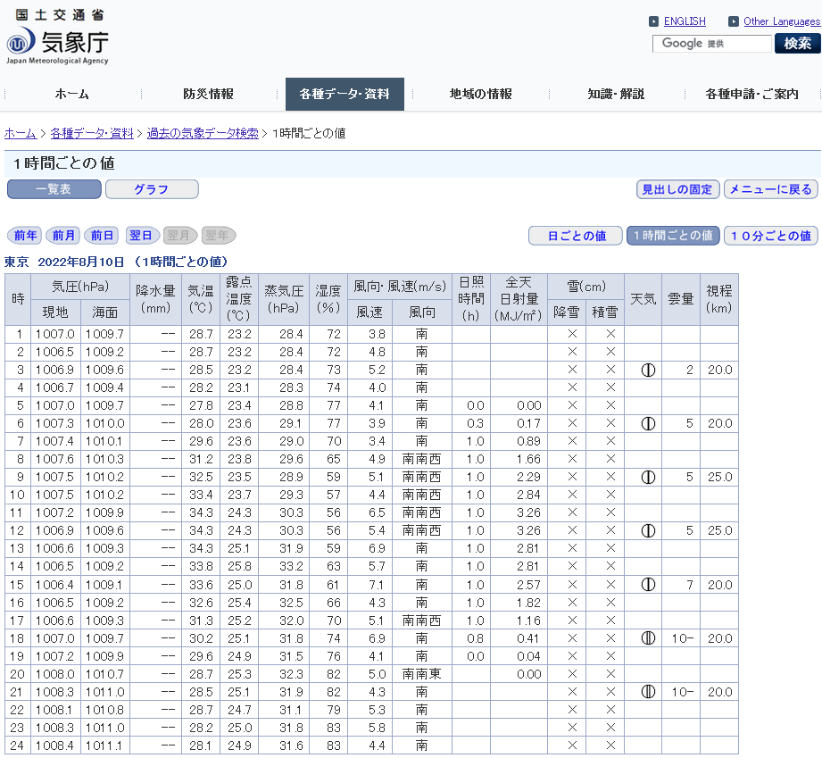
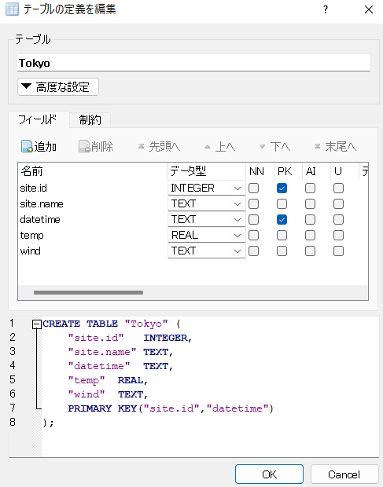

# 取得するデータ

気象庁の[過去の気象データ検索](https://www.data.jma.go.jp/obd/stats/etrn/index.php?prec_no=44&block_no=47662&year=2022&month=08&day=10&view=)から東京の2022年8月10日の気温と風向を取得する．  
[東京 2022年8月10日（1時間ごとの値）](https://www.data.jma.go.jp/obd/stats/etrn/view/hourly_s1.php?prec_no=44&block_no=47662&year=2022&month=8&day=10&view=)



# URL解析

取得したいデータがあるウェブページのURLを見てどのような規則で表示されているかを推察する．  

    https://www.data.jma.go.jp/obd/stats/etrn/view/hourly_s1.php?prec_no=44&block_no=47662&year=2022&month=8&day=10&view=  

この例では，prec_no，block_noは恐らく気象観測所に関する番号であろう，year，month，dayが年月日だろうと当たりが付く．このようにパラメータを含む形でURLが記載されている場合でページソースにHTMLテーブルやXMLの形式でデータがある場合（ウェブ画面を右クリックしソースを表示すると分かる）は，パラメータをプログラムで変えることで異なるウェブページに機械的にアクセスしデータを取得できる．
ただし，Yahoo！ファイナンスのようにウェブサーバーの負荷の問題からウェブスクレイピングを禁止してるところもあるので利用規約を読むことが必要．ウェブスクレイピング自体は合法的である．  

cf. [スクレイピングは違法？Webスクレイピングに関する10のよくある誤解！](https://www.octoparse.jp/blog/10-myths-about-web-scraping)

# 設定  

```{r}
# 出力ファイル
DB  <- 'weather.db'  # データベース名
F.O <- 'weather.csv' # CSVファイル名

# 気象観測所
site <- data.frame(
  id   = 47662,   # 番号
  name = 'Tokyo') # 名称（データベースのテーブル名として使う）

# システムロケール（海外クラウド環境利用時に必要な時間と言語の設定）
Sys.setlocale("LC_TIME", "ja_JP.UTF-8")

# 対象日時（テーブル取得のためのURLに適用する日時）
lt <- as.POSIXlt('2022-08-10') # POSIX準拠ローカル時間
year  <- 1900 + lt$year
month <- 1 + lt$mon
day   <- lt$mday
```

# URL作成

```{r}
url <- paste0('https://www.data.jma.go.jp/obd/stats/etrn/view/hourly_s1.php?prec_no=44&block_no=', site$id, '&year=', year, '&month=', month, '&day=', day, '&view=')

cat('URL:', url, fill = T) # 作成したURLを表示
```

# ウェブページのデータ取得 (Web scraping)

## テーブル取得

```{r}
library(rvest)
tbl <- read_html(url) %>% html_table()
tbl
```

tblをプリントし，どのテーブルに必要なデータが格納されているか確認すると5番目のテーブル（リスト）にあることが分かる．
次で5番目のリストを取り出す．すべてテキストデータ(chr)になっている．
```{r}
d0 <- as.data.frame(tbl[[5]])
str(d0)
```

## テーブルの整形

日時などの情報追加，変数の型指定，データの整形を行い，書込用テーブルを作成する． 日時のフォーマット（%Y-%m-%d %H:%M:%Sなど)はどのプログラミング言語でもほぼ共通なのでしっかりと記憶しておくこと．Rコンソールで「?strptime」とタイプすれば他の記号も調べることができる．

```{r}

# 日時整形
hour <- d0[-1, '時'] # 1列目は時刻1～24（-1:一行目は不要なため削除）
# コンピュータの世界(POSIX準拠)では24時は存在しないので0～23にする必要がある．
# コンピュータ上では24時は翌日の日付になる．
datetime <- as.POSIXlt(paste(lt, hour),        # 例）2022-08-10 24
                       format = '%Y-%m-%d %H') # 例の様な数字を「年-月-日 時」として読込む
                                               # 自動で時刻が0～23に変換される．

# 書込用テーブル作成
d1 <- data.frame(site.id   = as.integer(site$id), # 整数型
                 site.name = site$name,
                 datetime  = format(datetime, '%Y-%m-%d %H:00'),
                 temp      = as.double(d0[-1, 5]), # 倍精度浮動小数点型
                 wind      = d0[-1, 10])
str(d1)
```

# データ保存

## データベース（SQLite）への保存

```{r}
library(RSQLite)

# データベース接続
conn <- dbConnect(RSQLite::SQLite(), DB)

# 既存テーブル削除（必要に応じて実施）
dbSendQuery(conn, paste('DROP TABLE IF EXISTS', site$name))
```

```{r warning=FALSE}
# テーブル追記書込
dbWriteTable(conn, site$name, d1, append = T)

```

レコードを重複して保存したくない場合は，レコードがユニークになるように PRIMARY KEYを設定するとよい．DB Browser for SQLiteなどのGUIツールを使うと簡単に設定できる．設定すると重複するレコードが来たときにプログラムはエラー停止する．繰返計算などで停止させたくないときはtry()関数を付けるとプログラム実行を継続できる．



複数のカラムを組み合わせたPRIMARY KEY（PK）とすることでレコードがユニークになる．また，データハンドリングも高速になる利点もある．

```{r}
# データ選択（ちゃんと保存されたか確認すること）
res <- dbSendQuery(conn, 'SELECT * FROM Tokyo')

# 選択結果取得
dbFetch(res)

# 選択結果解放
dbClearResult(res)

# データベース接続解除 
dbDisconnect(conn)
```

## CSVファイルへの保存

```{r}
# 既存ファイル削除（必要に応じて実施）
file.remove(F.O)

# テーブル追記書込
library(data.table)
fwrite(d1, file = F.O, sep = ',', append = T)
```

```{r}
# 読込確認
(d2 <- fread(file = F.O))
```

# 演習課題

次をおこなうRソースファイル（拡張子：R）を作成，プログラム実行しデータベースを作成せよ．また，値が無いところはどうすれば良いか検討せよ．

    2021年12月31日～2022年1月1日までの気象データ（気温，湿度，日照時間，風向）をデータベースに格納する．

ただし，forループを使いデータを取得すること．

【重要】プログラムで連続してデータ収集する場合は，ウェブサーバーの負荷軽減のため，プログラムを休止させるコマンド：Sys.sleep(runif(1, min = 1, max = 2))をループ内に置き1～2秒の間隔でデータを取得すること．（忘れたら0点）

ヒント：
```{r}
lt.fr <- as.POSIXlt('2021-12-30')
lt.to <- as.POSIXlt('2022-01-01')
lst   <- as.POSIXlt(seq(lt.fr, lt.to, by = 'days'))
lst
```
