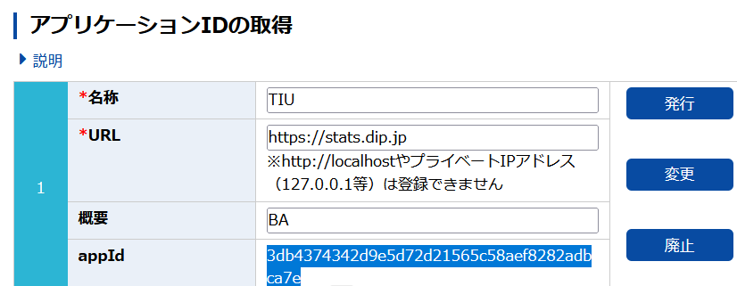

# APIを用いたデータの収集（政府統計データ）

[e-Stat(政府統計の総合窓口)](https://www.e-stat.go.jp/)
は、日本の統計が閲覧できる政府統計ポータルサイトです．

[出典：【総務省 ICTスキル総合習得教材】4-3（一部改変）](https://www.soumu.go.jp/ict_skill/pdf/ict_skill_4_3.pdf)



```{r}
#install.packages("estatapi")
library(estatapi)
appID <- '3db4374342d9e5d72d21565c58aef8282adbca7e'

#e-Stat内を『消費者物価指数』で検索
estat_getStatsList(appId = appID, searchWord = "消費者物価指数")

#2015年基準消費者物価指数（statsDataId=0003143513）のデータ説明をdata_infoへ格納
data_info <- estat_getMetaInfo(
  appId       = appID,
  statsDataId = "0003143513")

#品目コードと地域コードを調べるため、cat01およびareaをRのデータフレームとして格納
di_cat01 <- data_info$cat01
di_area  <- data_info$area
```

```{r}
#取得したコードを指定してe-Stat APIからデータを取得し、epdataに格納
epdata <- estat_getStatsData(
  appId       = appID,
  statsDataId = '0003143513', # 2015年基準消費者物価指数
  cdTab       = '1',          # 物価指数
  cdCat01     = '0056' ,      # 電気代
  cdArea      = c('01A01',    # 札幌市
                  '47A01'),   # 那覇市
  lvTime = '4',               # 月次データ
  cdTimeFrom = '2016')        # データ取得開始年
```

```{r}
library(data.table)
fwrite(epdata, "estat_icecream_9area_price.csv", sep = ",")
epdata
```